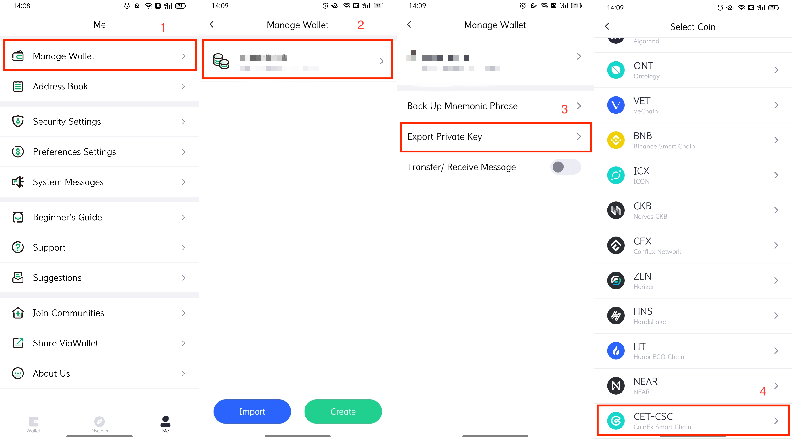

# FAQ

## Can the validator node address, staker address and reward receipt address be different?

`CSC` separates validator node address, staker address and reward receipt address, they can be different。
Because the block needs to be signed, the `keystore` and password to the validator node address must be placed on the server.
Any address can stake to a validator node. After the staker address unstake and withdraw the staking, the staked `CET` will be returned to the original staker address.
The reward of the validator node will be uniformly allocated to the reward receipt address set by the validator node, and only the reward receipt address can withdraw the reward.

## Can the staker address be the CET address in the Coinex exchange?

No. Validator address, staker address and reward receipt address can't be the address in the Coinex exchange. You need to transfer your CET to an address on the `CSC` where you have the secret key.

## How can a MetaMask wallet address stakes？

'cetd' needs 'keystore' file to send transactions, you can export the private key from `MetaMask` to create 'keystore' file.

First, export the private key from `MetaMask` and save it to a file.

Then import the private key from the command line:
```
$ cetd account import YOUR-PRIVATE-KEY-FILE --datadir YOUR-KEYSTORE-PATH

INFO [07-03|00:03:06.072] Maximum peer count                       ETH=200 LES=0 total=200
INFO [07-03|00:03:06.080] Set global gas cap                       cap=25000000
Your new account is locked with a password. Please give a password. Do not forget this password.
Password:               # input keystore password
Repeat password:        # input keystore password again
```
- `YOUR-PRIVATE-KEY-FILE` fill in the private key file
- `YOUR-KEYSTORE-PATH` fill in the directory in which to save the 'keystore' file
- When you meet error like `Fatal: Failed to load the private key: invalid character '2' at end of key file`, delete '0x' at the beginning of the private key
- The generated `keystore` file will be in `YOUR-KEYSTORE-PATH/keystore` with the file name like `UTC--2021-07-02T16-03-11.895849700Z--YOUR-ADDRESS`

## How can a ViaWallet wallet address stakes？

'cetd' needs 'keystore' file to send transactions, you can export the private key from `ViaWallet` to create 'keystore' file.

First, export the private key from `ViaWallet` and save it to a file.


Then import the private key from the command line:
```
$ cetd account import YOUR-PRIVATE-KEY-FILE --datadir YOUR-KEYSTORE-PATH

INFO [07-03|00:03:06.072] Maximum peer count                       ETH=200 LES=0 total=200
INFO [07-03|00:03:06.080] Set global gas cap                       cap=25000000
Your new account is locked with a password. Please give a password. Do not forget this password.
Password:               # input keystore password
Repeat password:        # input keystore password again
```
- `YOUR-PRIVATE-KEY-FILE` fill in the private key file
- `YOUR-KEYSTORE-PATH` fill in the directory in which to save the 'keystore' file
- When you meet error like `Fatal: Failed to load the private key: invalid character '2' at end of key file`, delete '0x' at the beginning of the private key
- The generated `keystore` file will be in `YOUR-KEYSTORE-PATH/keystore` with the file name like `UTC--2021-07-02T16-03-11.895849700Z--YOUR-ADDRESS`

## Can the validator node use the fast mode?

Yes.

## How to check node synchronization status?

You can check the height of your nodes with the `curl` command.
`curl -X POST --data '{"jsonrpc":"2.0","method":"eth_blockNumber","params":[],"id":52}' -H "Content-Type: application/json" "http://127.0.0.1:8545"`

Or via 'attach' command and go to the command line console
```
$ cetd attach data/cetd.ipc 
Welcome to the Geth JavaScript console!

instance: cetd/v1.0.0-stable-dfe1768e/linux-amd64/go1.15.6
at block: 455139 (Wed Jul 14 2021 15:06:32 GMT+0800 (CST))
 datadir: /root/workspace/csc-run-fullnode/data
 modules: admin:1.0 debug:1.0 eth:1.0 miner:1.0 net:1.0 personal:1.0 rpc:1.0 senatus:1.0 txpool:1.0 web3:1.0

To exit, press ctrl-d
> eth.blockNumber
455141
```

## How long can the staking be withdrew after stake? How long can the staking be withdrew after unstake?

You can unstake at any time after you stake, but you need to wait for 86,400 blocks to withdraw your staking. Based on the current 3s block time, it probably needs to wait for 3 days.
Each time you unstake, you can only unstake and withdraw all the staking you have staked to the validator node.

## How often can I withdraw the reward?

It must be more than 28800 blocks since you withdrawn reward last time.

## How do you unjail a node?

If a node had been jailed, the first thing to do is investigate the cause. Restart the node after you fix the problem, and unjail the node through command line operation after the node is up and running properly and synchronizing to the latest height.

## gasprice

`CSC` limits the transaction minimum gasprice to 500GWEI.
